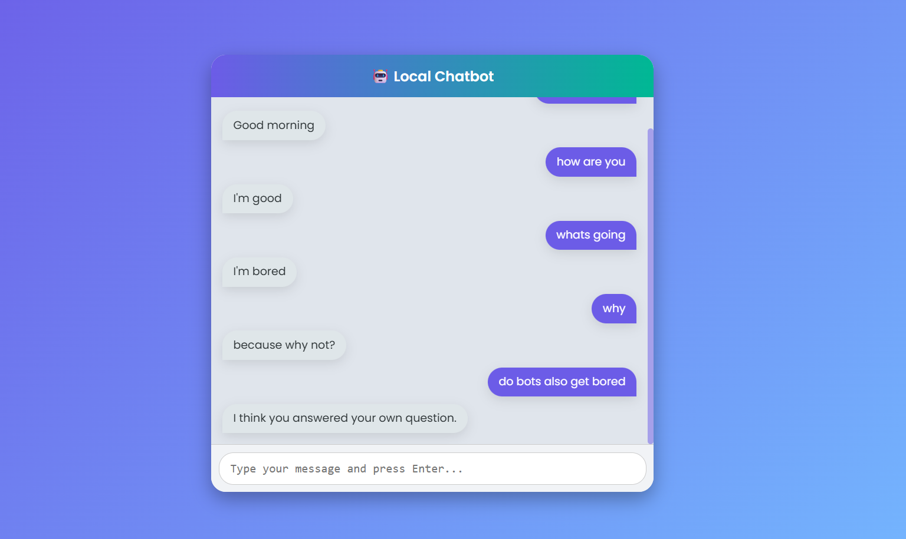

# 🤖 AI-Based Chatbot using Python (DialoGPT Local Model)

An intelligent **AI-powered chatbot** built using **Python, Flask, and a local DialoGPT model** from Hugging Face Transformers.  
This chatbot simulates natural human-like conversations and provides an attractive, modern web-based UI for interaction — all running **offline** without external APIs.

---

## 🧠 Project Overview

This project demonstrates the creation of a **local conversational AI chatbot** that can process user input and generate contextually appropriate responses using a pretrained language model.  
The backend is powered by **Python and Flask**, and the frontend is a fully responsive **HTML, CSS, and JavaScript** interface with animations for a better user experience.

---

  
*A simple and interactive ChatBot application that provides real-time weather updates for any city in the world.*

[**Checkout Local ChatBot Live**](https://weather-app-gaurav.vercel.app/)

---

## 🧩 Features

✅ **Offline Chatbot (No Internet Needed)**  
✅ **Powered by DialoGPT Model (Hugging Face Transformers)**  
✅ **Modern, Attractive UI with Animations**  
✅ **Typing Indicator & Smooth Message Bubbles**  
✅ **Lightweight Flask Backend API**  
✅ **Easy to Run and Customize**

---

## 🏗️ System Architecture

┌──────────────────────────────┐
│ Frontend                     |
│ HTML • CSS • JavaScript      │
│ ↓ (Fetch API)                │
├──────────────────────────────┤
│ Backend                      │
│ Flask (Python)               │
│ ↓                            │
│ Hugging Face DialoGPT Model  │
│ (Local Response Generation)  │
└──────────────────────────────┘


---

## ⚙️ Tech Stack

 ----------------------------------------------------------
| Component         | Technology                           |
|-------------------|--------------------------------------|
| **Frontend**      | HTML5, CSS3, JavaScript              |
| **Backend**       | Python (Flask Framework)             |
| **AI Model**      | DialoGPT (Hugging Face Transformers) |
| **Environment**   | Localhost / Offline                  |
| **IDE**           | VS Code / PyCharm                    |
 ----------------------------------------------------------
---

## 🧾 Project Setup

### 1️⃣ Clone the Repository
```bash
git clone https://github.com/your-username/AI-Chatbot-Local.git
cd AI-Chatbot-Local
```

### 2️⃣ Create Virtual Environment
```bash
python -m venv venv
source venv/bin/activate       # For Mac/Linux
venv\Scripts\activate          # For Windows
```

### 3️⃣ Install Dependencies
```bash
pip install flask transformers torch
```

### 4️⃣ Run the Flask Server
```bash
python app.py
```

### 5️⃣ Open in Browser
Navigate to 👉 http://127.0.0.1:5000

---

**🎨 User Interface Preview**

- ✨ A clean and responsive chat interface built with modern CSS styling
- 🟢 Smooth fade animations and typing indicator
- 📱 Fully responsive — works on desktop and mobile

**🚀 Future Enhancements**

- Add voice input and speech output for hands-free chatting.
- Enable multi-turn memory for more context-aware conversations.
- Integrate emotion and sentiment analysis.
- Support multilingual conversations.
- Create chat history logs and analytics dashboard.

**🧑‍💻 Author**

Gaurav Kumar
🎓 B.Tech in Computer Science & Engineering
💡 Passionate about Artificial Intelligence, Software Development, and Full Stack Projects
📧 LinkedIn: [Gaurav Kumar](https://www.linkedin.com/in/gaurav-kumar-25-oct?lipi=urn%3Ali%3Apage%3Ad_flagship3_profile_view_base_contact_details%3BW7%2FB5onwS4yNaZXl9gxzoA%3D%3D)
GitHub: [KumarGaurav007](https://github.com/KumarGaurav007)

📝 License

This project is open-source and available under the MIT License.